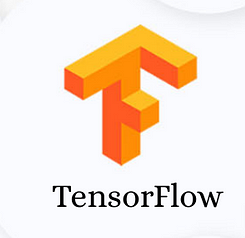

# Cat and Dog Classifier
- In  this project i can build a cat and dog classifer this model can easily classify the cat and dog.

# Tool Use
- We can use the following tools.
    - **Numpy**
        - 

    - **Tensorflow**
        - 
    - **Keras**
        - 

# Use Case
- Clone the repo
    ```python
        git clone https://github.com/Sami606713/cat_dog_classification.git
    ````
- Install Libraries
```
pip install -r requirements.txt
```
- Run the app
```python
stremlit run app.py
```
